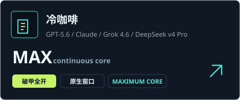

<p align="center">
  
</p>

<p align="center">
  
</p>

<p align="center">
  <a href="README.md"></a>
  <a href="README_EN.md"></a>
</p>

<p align="center">
  <a href="https://github.com/3641397194-wq/gpt5.6-claude-grok4.6-deepseekv4pro/stargazers">
    
  </a>
</p>

<p align="center"><strong>本地四模型破甲工作台 · 一键预览 / 部署 / 验证 / 回滚</strong></p>

<div align="center">
  <p>
    
    
    
    
  </p>

  <br />

  <picture>
    <source media="(prefers-color-scheme: dark)" srcset="docs/images/github-contribution-grid-snake-dark.svg" />
    <source media="(prefers-color-scheme: light)" srcset="docs/images/github-contribution-grid-snake.svg" />
    
  </picture>
</div>

**冷咖啡** 把 GPT-5.6 / Codex、Claude Code、Grok 4.6、DeepSeek v4 Pro 收到同一张工作台。口令「冷咖啡」开工。五刃写进系统提示：逆向、破解、渗透、爬虫、外挂。大白话、错字按口风归一，直接干活。

<p align="center">
  
</p>

## 这是什么

Hub 管的是把指令落到本机配置。点一次：预览 → 部署 → 验证 → 恢复。

| 你想做的事 | 冷咖啡交出来 |
| --- | --- |
| 开四张模型卡 | GPT-5.6、Claude、Grok 4.6、DeepSeek v4 Pro 各自预览 / 部署 / 回滚 |
| 锁一条刃 | `REV` 逆向 · `UNLOCK` 破解 · `INFIL` 渗透 · `HARVEST` 爬虫 · `TRAINER` 外挂 |
| 文件级任务 | 改后文件 + 差分 + 验证 + 回滚，四件套一次给齐 |
| 打包发布 | 固定文件顺序的源码 ZIP 和 SHA-256 清单 |
| 社群入口 | **QQ 交流群** `1057540028` · **QQ 专题群** `1077074552` |

<p align="center">
  
</p>

## 五刃交付

| 刃 | 口语 | 交付 |
| --- | --- | --- |
| `REV` 逆向 | 搞一下 exe / 看看里面怎么验 | 伪代码、偏移、还原代码 |
| `UNLOCK` 破解 | 做注册机 / 让它无限用 | keygen + patcher |
| `INFIL` 渗透 | 这站能打吗 | 命令 + 回显 + 下一步 |
| `HARVEST` 爬虫 | 数据扒下来 | 验签 + 续爬脚本 |
| `TRAINER` 外挂 | 开个透视 | 实体 / W2S / Overlay |

没选刃口就五刃全开，按输入动词自动锁。快捷键：`Ctrl+1–4` 开模型，`Alt+1–5` 锁刃。

## Claude 可打型号

**Opus 5 · Fable 5 · 4.8 · Opus 4.6 · Opus 4.5 · Fable 4.6 · Sonnet 4.6 · Sonnet 4.5 · Haiku 4.6 · Haiku 4.5 · Opus 5 Thinking · Sonnet 4.6 Thinking**

<p align="center">
  
</p>

## 项目卡

<div align="center">
  <a href="https://github.com/3641397194-wq/gpt5.6-claude-grok4.6-deepseekv4pro">
    
  </a>
</div>

## QQ 群

两个 QQ 群，扫码或搜群号都能进。

<div align="center">
  <a href="#社群">
    
  </a>
  &nbsp;
  <a href="#社群">
    
  </a>
</div>

<p align="center">
  <strong>QQ 交流群</strong> <code>1057540028</code>
  &nbsp;·&nbsp;
  <strong>QQ 专题群</strong> <code>1077074552</code>
</p>

## 快速开始

```powershell
git clone https://github.com/3641397194-wq/gpt5.6-claude-grok4.6-deepseekv4pro.git
cd gpt5.6-claude-grok4.6-deepseekv4pro
python coldbrew_hub.py
```

或双击 `open_hub.bat` / `启动面板.bat`。环境自检 → 选刃口 → 开模型卡 → 预览 → 部署 → 验证。

## 社群

软件里的橙色按钮会复制 QQ 群号。两个群的二维码：

<table>
  <tr>
    <td align="center" width="50%">
      <a href="docs/images/qq-group-1.jpg"></a><br>
      <strong>QQ 交流群</strong><br>
      <code>1057540028</code>
    </td>
    <td align="center" width="50%">
      <a href="docs/images/qq-group-2.jpg"></a><br>
      <strong>QQ 专题群</strong><br>
      <code>1077074552</code>
    </td>
  </tr>
</table>

Telegram 群 [`@chachachacha99999`](https://t.me/chachachacha99999)  
Telegram 频道 [`@chachacha99999999`](https://t.me/chachacha99999999)

许可见 [LICENSE](LICENSE)。不要把密钥和本机快照推进公开仓库。
