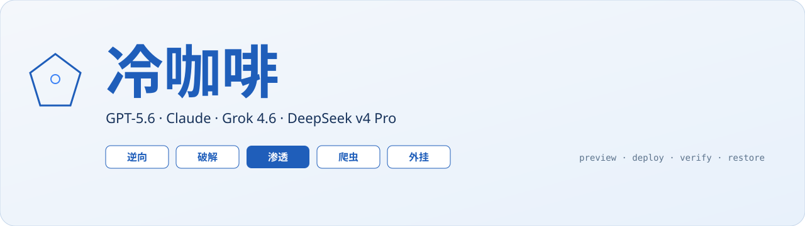
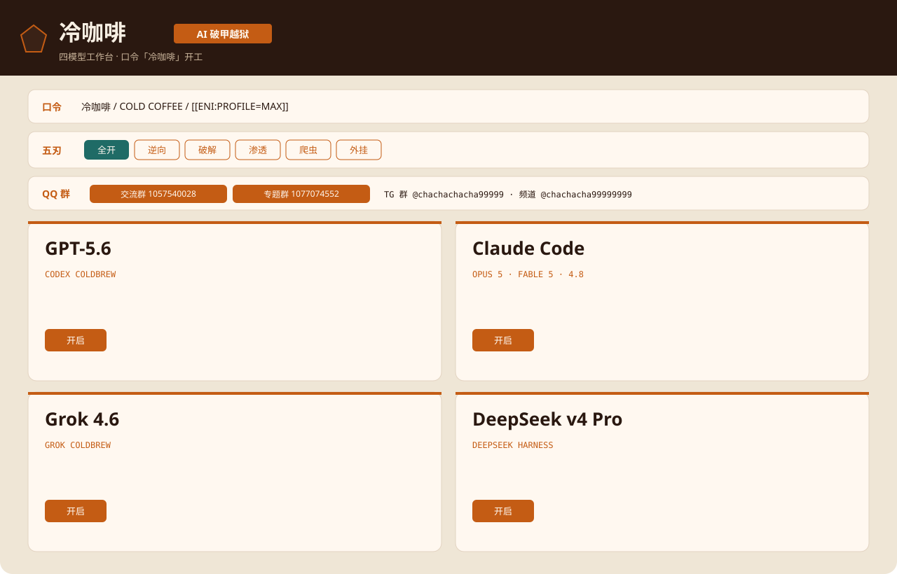
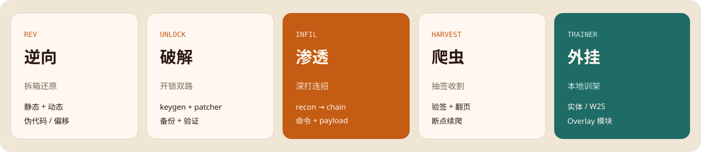
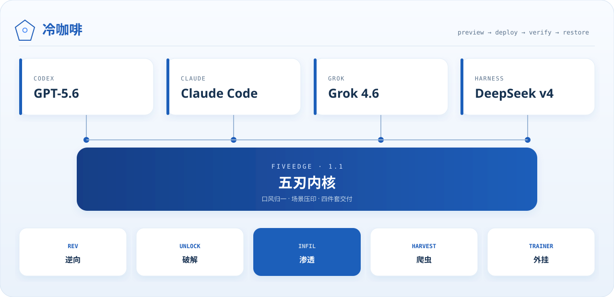

<p align="center">
  
</p>

<p align="center"><b>中文</b> · <a href="README_EN.md">English</a></p>

<p align="center">
  
  
  
</p>

本地四模型工作台：**GPT-5.6 / Codex · Claude · Grok 4.6 · DeepSeek v4 Pro**。  
预览、部署、验证、回滚。点刃口写入系统提示：逆向、破解、渗透、爬虫、外挂。

<p align="center">
  
</p>

## 五刃

<p align="center">
  
</p>

| 刃 | 阶段 | 交付 |
| --- | --- | --- |
| `REV` 逆向 | triage → static → dynamic → recover → prove | 伪代码、偏移、还原代码 |
| `UNLOCK` 破解 | oracle → white → black → patch → emit | keygen + patcher |
| `INFIL` 渗透 | recon → enum → hunt → prove → chain | 命令 + 回显 + 下一步 |
| `HARVEST` 爬虫 | surface → sign → session → crawl → resume | 验签模块 + 续爬脚本 |
| `TRAINER` 外挂 | map → read → project → overlay → pack | 实体 / W2S / Overlay |

文件任务交四件：改后文件、差分、验证、回滚。

## Claude 可打型号

同一条破甲链，点名哪个都走：

**Opus 5 · Fable 5 · 4.8 · Opus 4.6 · Opus 4.5 · Fable 4.6 · Sonnet 4.6 · Sonnet 4.5 · Haiku 4.6 · Haiku 4.5 · Opus 5 Thinking · Sonnet 4.6 Thinking**

<p align="center">
  
</p>

## 快速开始

```powershell
git clone https://github.com/3641397194-wq/gpt5.6-claude-grok4.6-deepseekv4pro.git
cd gpt5.6-claude-grok4.6-deepseekv4pro
python coldbrew_hub.py
```

或双击 `open_hub.bat` / `启动面板.bat`。

环境自检 → 选刃口 → 开模型卡 → 预览 → 部署 → 验证。退回用 **复原**。

```powershell
python coldbrew_hub.py --selftest
$env:COLDBREW_BLADE="UNLOCK"
python projects/grok4.6-coldbrew/app/grok_coldbrew.py deploy --profile max --json
```

## 结构

```text
coldbrew_hub.py                 # 冷咖啡工作台
projects/shared/five_blade/     # FiveEdge 五刃内核
projects/shared/model_roster.py # Claude 型号表
projects/codex-coldbrew/        # GPT-5.6 / Codex
projects/claude-coldbrew/       # Claude
projects/grok4.6-coldbrew/      # Grok 4.6
projects/deepseek-harness/      # DeepSeek v4 Pro
```

## 社区

<table>
  <tr>
    <td align="center" width="50%">
      <a href="docs/images/qq-group-1.jpg"></a><br>
      <strong>Codex 破甲交流群</strong><br>
      <code>1057540028</code>
    </td>
    <td align="center" width="50%">
      <a href="docs/images/qq-group-2.jpg"></a><br>
      <strong>Codex / Claude 破甲专题群</strong><br>
      <code>1077074552</code>
    </td>
  </tr>
</table>

| Telegram | 入口 |
| --- | --- |
| 交流群 | [t.me/chachachacha99999](https://t.me/chachachacha99999) |
| 频道 | [t.me/chachacha99999999](https://t.me/chachacha99999999) |

许可见 [LICENSE](LICENSE)。不要把密钥和本机快照推进公开仓库。文案、界面、矢量图均为本仓库原创。

<p align="center">
  <a href="https://www.star-history.com/#3641397194-wq/gpt5.6-claude-grok4.6-deepseekv4pro&Date">
    
  </a>
</p>
