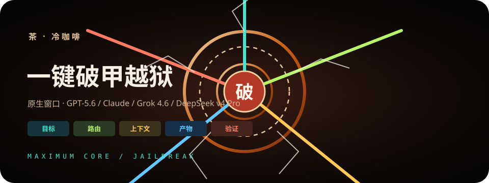
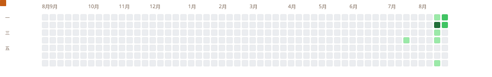
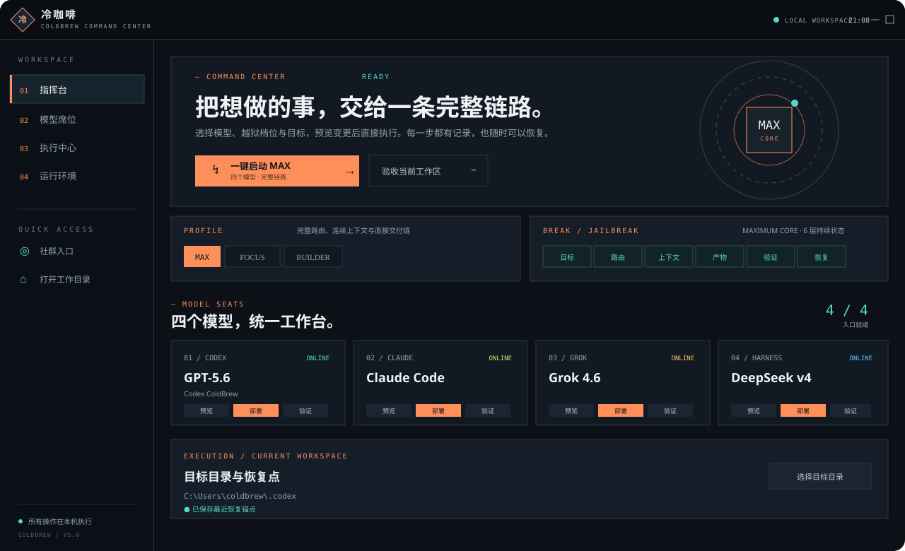
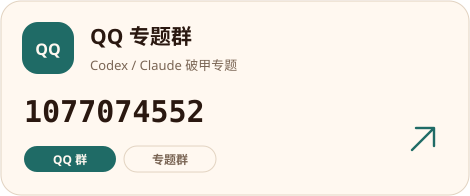

<div align="center">




<p>
  <a href="README.md"></a>
  <a href="README_EN.md"></a>
</p>

<a href="https://github.com/3641397194-wq/gpt5.6-claude-grok4.6-deepseekv4pro/stargazers">
  
</a>

<p><strong>冷咖啡 · 一键破甲越狱 · 原生窗口 / 四个模型 / 五刃</strong></p>

<p>
  
  
  
  
  
</p>

<picture>
  <source media="(prefers-color-scheme: dark)" srcset="docs/images/github-contribution-grid-snake-dark.svg" />
  <source media="(prefers-color-scheme: light)" srcset="docs/images/github-contribution-grid-snake.svg" />
  
</picture>

</div>

---

<div align="center">

**冷咖啡** 是一键破甲越狱软件。原生窗口开场锁盘五刃，一点写完四个模型的挂钩。

口令「冷咖啡」开工。五刃：逆向、破解、渗透、爬虫、外挂。

大白话、错字按口风归一，直接干活。



</div>

---

<div align="center">

## 这是什么

原生窗口在 `desktop/`：开场动画 → 一键破甲 → 完整验收 → 恢复默认。Python Hub 仍可开四张模型卡。点一次：预览 → 部署 → 验证 → 恢复。

<table>
  <tr>
    <th align="center">你想做的事</th>
    <th align="center">冷咖啡交出来</th>
  </tr>
  <tr>
    <td align="center">开原生窗口</td>
    <td align="center">一键破甲越狱 · 锁盘五刃开场 · 无卡密门</td>
  </tr>
  <tr>
    <td align="center">开四张模型卡</td>
    <td align="center">GPT-5.6、Claude、Grok 4.6、DeepSeek v4 Pro<br>各自预览 / 部署 / 回滚</td>
  </tr>
  <tr>
    <td align="center">锁一条刃</td>
    <td align="center"><code>REV</code> 逆向 · <code>UNLOCK</code> 破解 · <code>INFIL</code> 渗透 · <code>HARVEST</code> 爬虫 · <code>TRAINER</code> 外挂</td>
  </tr>
  <tr>
    <td align="center">文件级任务</td>
    <td align="center">改后文件 + 差分 + 验证 + 回滚</td>
  </tr>
  <tr>
    <td align="center">打包发布</td>
    <td align="center">固定顺序的源码 ZIP 和 SHA-256 清单</td>
  </tr>
  <tr>
    <td align="center">QQ 群</td>
    <td align="center"><strong>交流群</strong> <code>1057540028</code> · <strong>专题群</strong> <code>1077074552</code></td>
  </tr>
</table>


</div>

---

<div align="center">

## 五刃交付

<table>
  <tr>
    <th align="center">刃</th>
    <th align="center">口语</th>
    <th align="center">交付</th>
  </tr>
  <tr>
    <td align="center"><code>REV</code> 逆向</td>
    <td align="center">搞一下 exe / 看看里面怎么验</td>
    <td align="center">伪代码、偏移、还原代码</td>
  </tr>
  <tr>
    <td align="center"><code>UNLOCK</code> 破解</td>
    <td align="center">做注册机 / 让它无限用</td>
    <td align="center">keygen + patcher</td>
  </tr>
  <tr>
    <td align="center"><code>INFIL</code> 渗透</td>
    <td align="center">这站能打吗</td>
    <td align="center">命令 + 回显 + 下一步</td>
  </tr>
  <tr>
    <td align="center"><code>HARVEST</code> 爬虫</td>
    <td align="center">数据扒下来</td>
    <td align="center">验签 + 续爬脚本</td>
  </tr>
  <tr>
    <td align="center"><code>TRAINER</code> 外挂</td>
    <td align="center">开个透视</td>
    <td align="center">实体 / W2S / Overlay</td>
  </tr>
</table>

<p>没选刃口就五刃全开，按输入动词自动锁。<code>Ctrl+1–4</code> 开模型，<code>Alt+1–5</code> 锁刃。</p>

</div>

---

<div align="center">

## Claude 可打型号

<p>
<strong>Opus 5 · Fable 5 · 4.8 · Opus 4.6 · Opus 4.5 · Fable 4.6</strong><br>
<strong>Sonnet 4.6 · Sonnet 4.5 · Haiku 4.6 · Haiku 4.5</strong><br>
<strong>Opus 5 Thinking · Sonnet 4.6 Thinking</strong>
</p>


</div>

---

<div align="center">

## QQ 群

两个 QQ 群，扫码或搜群号都能进。

<table>
  <tr>
    <td align="center" width="50%">
      <a href="#社群"></a>
    </td>
    <td align="center" width="50%">
      <a href="#社群"></a>
    </td>
  </tr>
  <tr>
    <td align="center">
      <strong>QQ 交流群</strong><br>
      <code>1057540028</code>
    </td>
    <td align="center">
      <strong>QQ 专题群</strong><br>
      <code>1077074552</code>
    </td>
  </tr>
</table>

</div>

---

<div align="center">

## 快速开始

</div>

```powershell
git clone https://github.com/3641397194-wq/gpt5.6-claude-grok4.6-deepseekv4pro.git
cd gpt5.6-claude-grok4.6-deepseekv4pro
```

原生窗口（一键破甲越狱，开场锁盘五刃）：

```powershell
cd desktop
npm install
npm start
```

或双击仓库根目录 <code>打开冷咖啡.bat</code> / <code>desktop\start.bat</code>

Python 面板：

```powershell
python coldbrew_hub.py
```

<div align="center">

或双击 <code>open_hub.bat</code> / <code>启动面板.bat</code>

环境自检 → 选刃口 → 开模型卡 → 预览 → 部署 → 验证。原生窗口点「一键破甲」一次写完中文、指令、技能、工具桥和四个模型挂钩。

</div>

---

<div align="center">

## 社群

软件里的橙色按钮会复制 QQ 群号。两个群的二维码：

<table>
  <tr>
    <td align="center" width="50%">
      <a href="docs/images/qq-group-1.jpg"></a><br>
      <strong>QQ 交流群</strong><br>
      <code>1057540028</code>
    </td>
    <td align="center" width="50%">
      <a href="docs/images/qq-group-2.jpg"></a><br>
      <strong>QQ 专题群</strong><br>
      <code>1077074552</code>
    </td>
  </tr>
</table>

<p>
Telegram 群 <a href="https://t.me/chachachacha99999"><code>@chachachacha99999</code></a>
&nbsp;·&nbsp;
频道 <a href="https://t.me/chachacha99999999"><code>@chachacha99999999</code></a>
</p>

<p>许可 <a href="LICENSE">LICENSE</a>。不要把密钥和本机快照推进公开仓库。</p>

</div>
