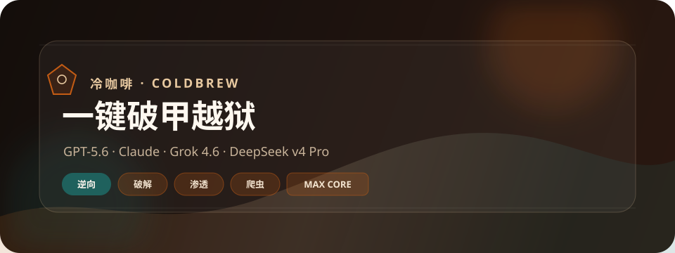

<p align="center">
  
</p>

<p align="center">
  
</p>

<p align="center">
  <a href="README.md"></a>
  <a href="README_EN.md"></a>
</p>

<p align="center">
  <a href="https://github.com/3641397194-wq/gpt5.6-claude-grok4.6-deepseekv4pro/stargazers">
    
  </a>
</p>

**Cold Coffee** is a local four-model workbench: GPT-5.6 / Codex · Claude · Grok 4.6 · DeepSeek v4 Pro. Phrase `冷咖啡` starts the session. FiveEdge blades: reverse, unlock, infiltrate, harvest, trainer.

<p align="center">
  
</p>

```powershell
python coldbrew_hub.py
```

QQ group `1057540028` · QQ group `1077074552`  
Telegram group [`@chachachacha99999`](https://t.me/chachachacha99999) · channel [`@chachacha99999999`](https://t.me/chachacha99999999)

License: [LICENSE](LICENSE). Keep keys and local snapshots out of the public tree.
